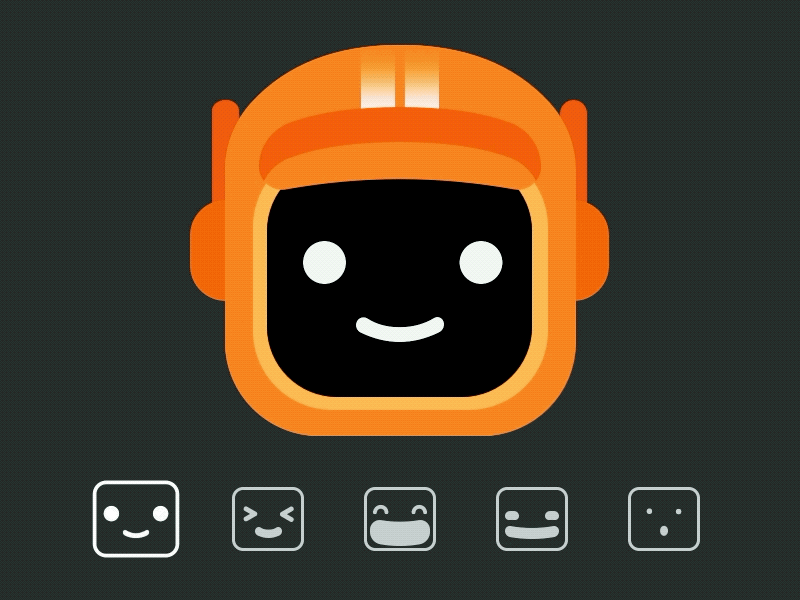
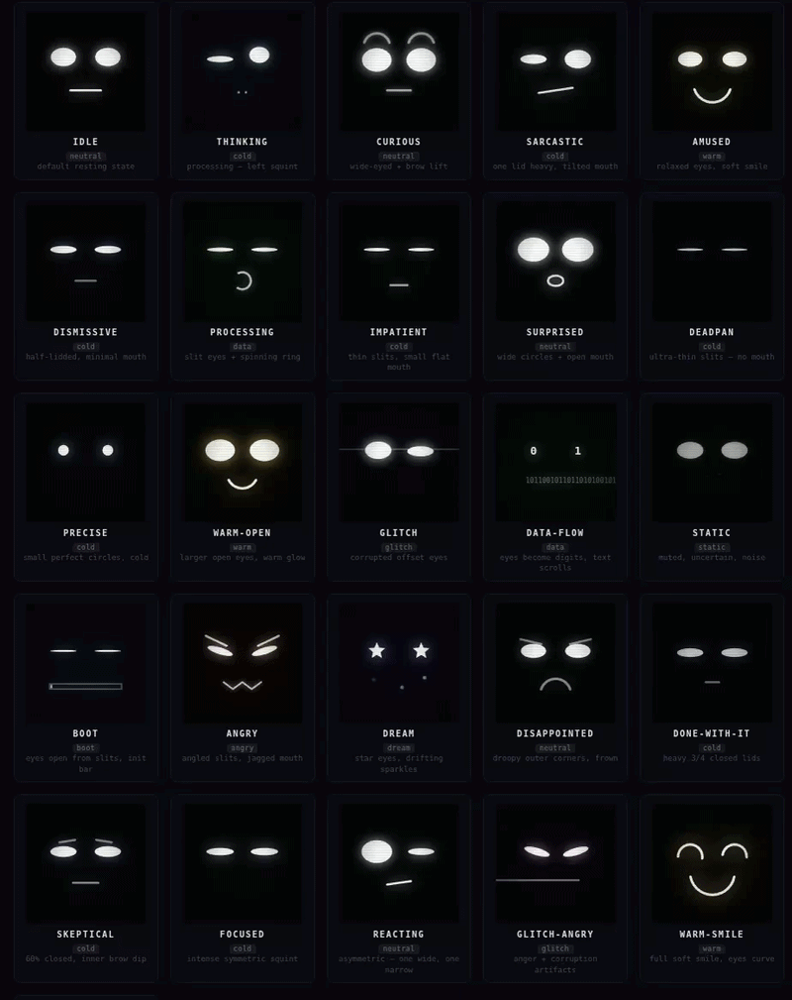

<div align="center">



# K-VRC

**A sarcastic AI robot that learned to move, feel, and speak.**

K-VRC is a real-time 3D robot character powered by Claude AI. It converses with a dry, deadpan personality, expresses itself through 100 handcrafted face states, moves its body using patterns distilled from real motion capture data, and speaks in a cloned voice — with its mouth driven by live audio amplitude.

**→ [Live Demo](https://k-vrc.vercel.app)**
&nbsp;&nbsp;·&nbsp;&nbsp;
**→ [Lakshya's Portfolio](https://lakshya-asu.github.io/web/portfolio)**

<br clear="right"/>

</div>

---

## Face Expressions



<video src="face_emotions.mp4" autoplay loop muted playsinline width="100%"></video>

K-VRC's face screen renders in real-time on a canvas texture mapped onto the robot's visor. Each expression is defined by six continuous weight parameters — brow raise, brow furrow, eye squint, mouth open, smile width, and glitch intensity — blended smoothly in the renderer. There are 100 named expressions across six emotional moods (cold, warm, reactive, digital, expressive, dark), each selected by Claude per response.

---

## Features

### 🤖 Learned Body Animations

K-VRC's body movements aren't scripted — they were distilled from video using a full ML pipeline built on [Modal](https://modal.com) GPU infrastructure:

- **Pose extraction** via ViTPose (upper-body keypoints) with YOLO11 fallback detection
- **Subject tracking** via SAM2 with OpenCV fallback
- **MiniLM sentence encoder** builds a shared context window from conversation history
- **Four prediction heads** output clip blend weights and motion deltas from text context
- Trained on real motion capture clips baked into the GLB, so every gesture (idle, talk, think, wave, celebrate, angry, sigh, and 18 more) emerges from learned structure rather than manual keyframing
- Inference runs live on each chat reply via a Modal T4 endpoint, selecting and blending clips in real-time

### 😐 100-State Expression Library

The face is rendered from a weight-based system with full expression blending:

- 100 named states spanning cold/analytical, warm/reactive, digital/glitchy, and dark moods
- 6-parameter weight space: `brow_raise`, `brow_furrow`, `eye_squint`, `mouth_open`, `smile_width`, `glitch_intensity`
- Smooth morphing between states at a configurable blend speed
- Boot animation, procedural blink, random glitch events, and emotion-reactive color palette
- Claude picks one expression slug per response; the face morphs to it instantly

### 🎙️ Cloned Voice + Live Mouth Animation

K-VRC speaks in a voice cloned from source audio using [XTTS v2](https://huggingface.co/coqui/XTTS-v2):

- Voice reference extracted from training video, uploaded to a Modal shared volume
- XTTS v2 model (~1.9 GB) cached on the volume — cold start ~30s, warm ~instant
- Inference runs on a T4 GPU via a FastAPI ASGI endpoint deployed on Modal
- Vercel proxies the request to Modal; the frontend receives raw MP3 bytes
- Audio decoded via **Web Audio API** (`AudioContext` → `AnalyserNode`) for real-time amplitude
- Mouth open parameter driven frame-by-frame from the analyser's frequency data — the robot's lips sync to actual audio energy, not a timer

### 💬 Character AI Chat

- Powered by **Claude Haiku** — fast, cheap, in-character
- K-VRC's personality: sarcastic, efficient, perpetually disappointed, occasionally impressed
- Structured JSON responses carry `reply`, `emotion`, `gesture`, `expression`, and optional `sidenote_topic`
- Conversation history window (last 20 turns) for contextual replies
- Sidenote panel surfaces Lakshya's research interests when conversation touches relevant topics (causal RL, sim-to-real, embodied AI, etc.)
- Voice input via Web Speech API

### 🏗️ Scene

- Three.js with Draco-compressed GLB, HDR environment lighting, Unreal bloom post-processing
- `MeshStandardMaterial` armor (orange-red) + dark joint materials, IBL from photostudio HDR
- Scroll to zoom camera, mouse-tracking head and chest rotation
- Procedural body float, emotion-reactive rim lighting (cyan RectAreaLight + PointLight)

---

## Architecture

```
Browser (Three.js + Web Audio API)
    │
    ├─ /api/chat  ──► Vercel Serverless ──► Anthropic Claude Haiku
    │                      │
    │                      └──► Modal /infer ──► MiniLM + prediction heads (T4)
    │
    ├─ /api/tts   ──► Vercel Serverless ──► Modal /tts ──► XTTS v2 (T4)
    │
    └─ /api/sidenote ──► Vercel Serverless ──► Claude Haiku
```

| Layer | Technology |
|---|---|
| Frontend | Vite, Three.js r170, Web Audio API |
| 3D | Draco GLB, RGBELoader HDR, EffectComposer bloom |
| AI Chat | Claude Haiku (`claude-haiku-4-5`) via Anthropic API |
| Animation Inference | Modal (T4), MiniLM, custom PyTorch heads |
| Voice Synthesis | Modal (T4), XTTS v2 (coqui), ffmpeg |
| Hosting | Vercel (frontend + API), Modal (GPU inference) |

---

## Local Setup

```bash
git clone https://github.com/lakshya-asu/k-vrc-webapp
cd k-vrc-webapp
npm install
```

Create `.env`:
```
ANTHROPIC_API_KEY=sk-ant-...
MODAL_INFER_URL=https://lakshya-asu--kvrc-animation-serve.modal.run
MODAL_TTS_URL=https://lakshya-asu--kvrc-tts-serve.modal.run
```

```bash
npm run dev   # frontend on :5173
```

---

<div align="center">

Built by [Lakshya Jain](https://lakshya-asu.github.io/web/portfolio)

</div>
