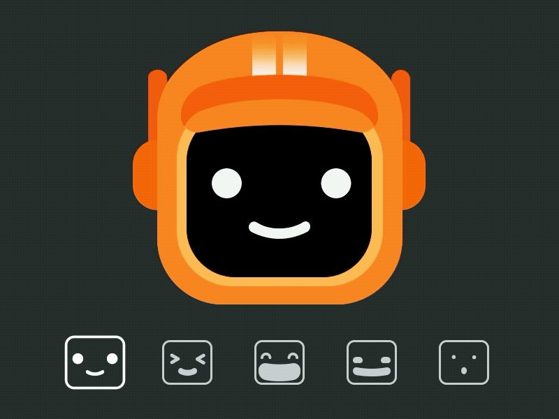
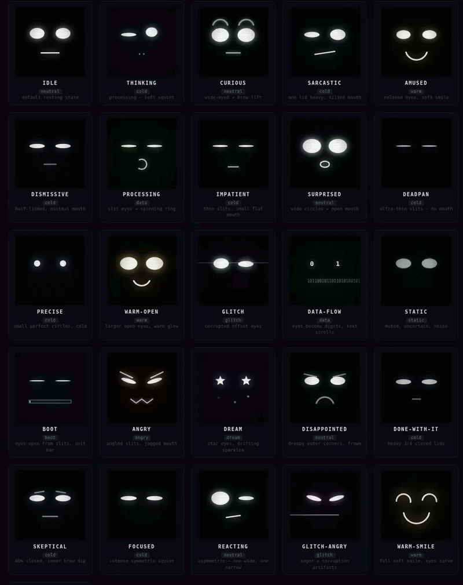

<div align="left">

# K-VRC

## Animus proof branch

`feat/animus-poc` uses K-VRC as the first Project Animus character. It adds a
provider-neutral actor contract, a small local-model route, Codex Luna and
Hermes operator routes, and a deterministic fallback.

Verified baseline: the current browser maps an LLM gesture label to baked GLB
clips. The repository contains a learned-animation scaffold, but it does not
track trained head weights, training data, an evaluation receipt, or a deploy
receipt. The current `blendClips` implementation plays the top clip rather than
performing weighted blending. Do not treat the historic learned-animation
section below as a verified deployment claim.

Start with [the Animus documentation](docs/animus/README.md) and
[the repository truth pass](docs/animus/truth-pass.md).


**A sarcastic AI robot that learned to move, feel, and speak.**

K-VRC is a real-time 3D robot character powered by Claude AI. It converses with a dry, deadpan personality, expresses itself through 100 handcrafted face states, moves its body using patterns distilled from real motion capture data, and speaks with an emotion-matched voice — with its face screen reacting live to audio amplitude.

**→ [Live Demo](https://k-vrc.vercel.app)**
&nbsp;&nbsp;·&nbsp;&nbsp;
**→ [Lakshya's Portfolio](https://lakshya-asu.github.io/web/portfolio)**

<br clear="right"/>

</div>

---

## Face Expressions



<video src="face_emotions.mp4" autoplay loop muted playsinline width="100%"></video>

K-VRC's face screen renders in real-time on a canvas texture mapped onto the robot's visor. Each expression is defined by six continuous weight parameters — brow raise, brow furrow, eye squint, mouth open, smile width, and glitch intensity — blended smoothly in the renderer. There are 100 named expressions across six emotional moods (cold, warm, reactive, digital, expressive, dark), each selected by Claude per response.

---

## Features

### 🤖 Learned Body Animations

K-VRC's body movements aren't scripted — they were distilled from video using a full ML pipeline built on [Modal](https://modal.com) GPU infrastructure:

- **Pose extraction** via ViTPose (upper-body keypoints) with YOLO11 fallback detection
- **Subject tracking** via SAM2 with OpenCV fallback
- **MiniLM sentence encoder** builds a shared context window from conversation history
- **Four prediction heads** output clip blend weights and motion deltas from text context
- Trained on real motion capture clips baked into the GLB, so every gesture (idle, talk, think, wave, celebrate, angry, sigh, and 18 more) emerges from learned structure rather than manual keyframing
- Inference runs live on each chat reply via a Modal T4 endpoint, selecting and blending clips in real-time

### 😐 100-State Expression Library

The face is rendered from a weight-based system with full expression blending:

- 100 named states spanning cold/analytical, warm/reactive, digital/glitchy, and dark moods
- 6-parameter weight space: `brow_raise`, `brow_furrow`, `eye_squint`, `mouth_open`, `smile_width`, `glitch_intensity`
- Smooth morphing between states at a configurable blend speed
- Boot animation, procedural blink, random glitch events, and emotion-reactive color palette
- Claude picks one expression slug per response; the face morphs to it instantly
- Idle expression cycling — 16 cold/subtle expressions rotate every 8–14 s between replies

### 🎙️ Voice — OpenAI TTS + Whisper STT

K-VRC speaks and listens using OpenAI's APIs:

- **TTS** — `gpt-4o-mini-tts` with the `echo` voice; each reply carries an emotion tag (`neutral`, `happy`, `sad`, `excited`, `angry`, `thinking`) that drives the delivery style via the `instructions` parameter
- **STT** — push-to-talk via OpenAI Whisper: hold **T** or the mic icon, speak, release — transcript auto-fires into Claude
- **Live mic visualizer** — 4 cyan frequency bars animate to your voice while recording
- **Face screen reacts to audio** — emissive intensity and expression scale pulse gently with speech amplitude, so the display breathes with the voice
- Audio decoded via **Web Audio API** (`AudioContext` → `AnalyserNode`); mouth open parameter driven frame-by-frame from frequency data

### 💬 Character AI Chat

- Powered by **Claude Haiku** — fast, cheap, in-character
- K-VRC's personality: sarcastic, efficient, perpetually disappointed, occasionally impressed
- Structured JSON responses carry `reply`, `emotion`, `gesture`, `expression`, and optional `sidenote_topic`
- Conversation history window (last 20 turns) for contextual replies
- Sidenote panel surfaces Lakshya's research interests when conversation touches relevant topics (causal RL, sim-to-real, embodied AI, etc.)

### 🏗️ Scene

- Three.js with Draco-compressed GLB, HDR environment lighting, Unreal bloom post-processing
- Hand-painted Blender materials — orange-red armor, dark joints, emissive face screen
- Scroll to zoom camera, mouse-tracking head and chest rotation
- Procedural body float, emotion-reactive rim lighting (cyan RectAreaLight + PointLight)

---

## Architecture

```
Browser (Three.js + Web Audio API)
    │
    ├─ /api/chat     ──► Vercel Serverless ──► Anthropic Claude Haiku
    │                          │
    │                          └──► Modal /infer ──► MiniLM + prediction heads (T4)
    │
    ├─ /api/tts      ──► Vercel Serverless ──► OpenAI gpt-4o-mini-tts (echo)
    │
    ├─ /api/stt      ──► Vercel Serverless ──► OpenAI Whisper
    │
    └─ /api/sidenote ──► Vercel Serverless ──► Claude Haiku
```

| Layer | Technology |
|---|---|
| Frontend | Vite, Three.js r170, Web Audio API |
| 3D | Draco GLB, RGBELoader HDR, EffectComposer bloom |
| AI Chat | Claude Haiku (`claude-haiku-4-5`) via Anthropic API |
| Animation Inference | Modal (T4), MiniLM, custom PyTorch heads |
| Voice Synthesis | OpenAI `gpt-4o-mini-tts` (echo voice, emotion-driven) |
| Speech Recognition | OpenAI Whisper (`whisper-1`) |
| Hosting | Vercel (frontend + API), Modal (GPU inference) |

---

## Local Setup

```bash
git clone https://github.com/lakshya-asu/k-vrc-webapp
cd k-vrc-webapp
npm install
```

Create `.env`:
```
ANTHROPIC_API_KEY=sk-ant-...
OPENAI_API_KEY=sk-...
MODAL_INFER_URL=https://lakshya-asu--kvrc-animation-serve.modal.run
```

```bash
npm run dev   # frontend on :5173
```

---

<div align="center">

Built by [Lakshya Jain](https://lakshya-asu.github.io/web/portfolio)

</div>
